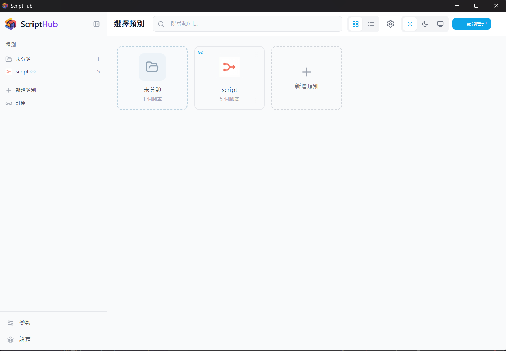
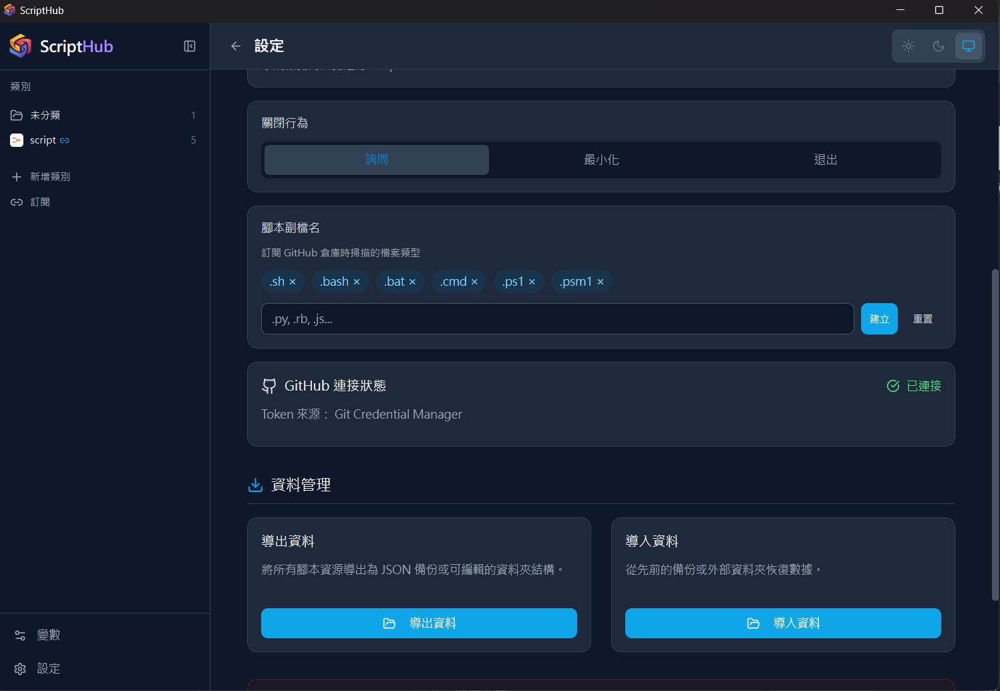

# 🎯 ScriptHub

[English](README.en.md) | [繁體中文](README.md) | 简体中文

跨平台命令脚本管理工具 — 高效存储、组织和分享你的常用命令

   


## ✨ 功能特色

### 脚本管理
- 📝 创建、编辑、删除脚本，支持多步骤命令流程
- 📋 一键复制单条命令或整个脚本
- ⭐ 收藏常用脚本，快速访问
- 🔍 实时搜索标题、描述和命令内容
- 🔀 拖拽排序脚本顺序



### 分类与标签
- 📁 文件夹式分类管理，支持 34 种预设图标及自定义图标上传
- 🖼️ 图标库功能，上传的图标可跨分类重复使用
- 🏷️ 彩色标签系统，灵活分类和筛选
- 🔀 拖拽排序分类顺序
- ⋮ 分类卡片右上角更多菜单（编辑、删除、更新订阅）

### 订阅与同步
- 🔗 订阅 GitHub 脚本库，自动导入脚本
- 🔄 一键同步更新订阅内容
- 📦 支持 ZIP 高效下载

### 数据管理
- 💾 SQLite 本地数据库存储
- 📤 导出为 JSON 备份或文件夹结构
- 📥 从备份或外部文件夹导入
- 🗂️ 单一分类导出功能



### 界面与体验
- 🌓 浅色 / 深色 / 跟随系统主题
- 📱 卡片网格与列表视图切换
- 🌐 繁体中文 / English 双语支持
- 🖥️ 动态侧边栏，根据当前页面切换功能
- 🖱️ 右键菜单支持（分类、脚本卡片）
- 🚀 开机自动启动（可选）
- 🔽 关闭时最小化到系统托盘

## 🚀 开始使用

### 下载安装

前往 [Releases](../../releases) 页面下载最新版本：
- **Windows**: `.msi` 安装包 或 `.exe` 安装程序
- **macOS**: `.dmg` 磁盘映像
- **Linux**: `.deb`、`.rpm` 或 `.AppImage`

### 从源码构建

#### 系统要求
- [Node.js](https://nodejs.org/) v18+
- [Rust](https://www.rust-lang.org/tools/install)
- Windows: [Microsoft Visual Studio C++ Build Tools](https://visualstudio.microsoft.com/visual-cpp-build-tools/)
- Linux: `build-essential`, `libwebkit2gtk-4.1-dev`, `libgtk-3-dev`, `libayatana-appindicator3-dev`, `librsvg2-dev`

#### 安装与开发

```bash
# 克隆项目
git clone https://github.com/Wing9897/ScriptHub.git
cd ScriptHub

# 安装依赖
npm install

# 开发模式（含 Tauri 桌面窗口）
npm run tauri dev

# 仅前端开发（浏览器预览）
npm run dev
```

#### 打包发布

```bash
npm run tauri build
```

产出位于 `src-tauri/target/release/bundle/`。

## 🎨 使用方式

### 创建脚本

1. 点击右上角「新增脚本」
2. 输入标题、描述，选择平台
3. 逐行输入命令，可为每步添加说明
4. 选择分类和标签
5. 点击「创建脚本」

### 订阅 GitHub 脚本库

1. 点击侧边栏「订阅」按钮
2. 输入 GitHub 仓库 URL（支持子目录路径）
3. 扫描并选择要导入的脚本
4. 之后可通过分类卡片的 ⋮ 菜单一键更新

## 📁 项目结构

```
ScriptHub/
├── src/                    # React 前端
│   ├── components/         # UI 组件
│   │   ├── layout/         # 布局（Sidebar, TopBar, MainLayout）
│   │   ├── category/       # 分类管理
│   │   ├── script/         # 脚本相关
│   │   ├── tag/            # 标签管理
│   │   ├── import/         # 文件导入
│   │   ├── subscription/   # 订阅功能
│   │   ├── settings/       # 设置页面
│   │   └── ui/             # 通用 UI 组件
│   ├── stores/             # Zustand 状态管理
│   ├── services/           # 数据库、GitHub、文件服务
│   ├── hooks/              # 自定义 Hooks
│   ├── i18n/               # 国际化（zh-HK, en-US）
│   ├── types/              # TypeScript 类型定义
│   └── utils/              # 工具函数
├── src-tauri/              # Tauri Rust 后端
│   ├── src/                # Rust 源码
│   ├── capabilities/       # 权限配置
│   └── tauri.conf.json     # Tauri 配置
├── public/                 # 静态资源
└── package.json
```

## 🛠️ 技术栈

| 技术 | 用途 |
|------|------|
| [Tauri 2](https://tauri.app/) | 桌面应用框架 |
| [React 18](https://react.dev/) | UI 框架 |
| [TypeScript 5](https://www.typescriptlang.org/) | 类型安全 |
| [Zustand 5](https://zustand.surge.sh/) | 状态管理 |
| [Tailwind CSS 3](https://tailwindcss.com/) | CSS 框架 |
| [Vite 6](https://vitejs.dev/) | 构建工具 |
| [SQLite](https://www.sqlite.org/) | 本地数据库 |
| [i18next](https://www.i18next.com/) | 国际化 |
| [Lucide React](https://lucide.dev/) | 图标库 |

## 📄 许可证

[MIT License](LICENSE)
